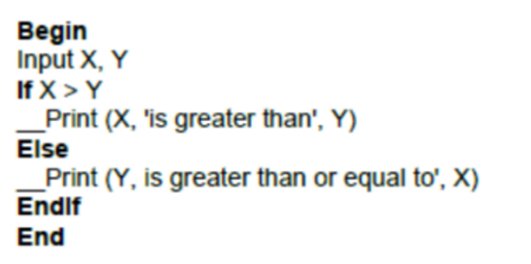
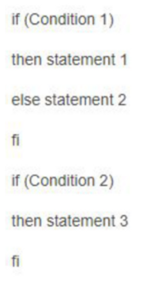
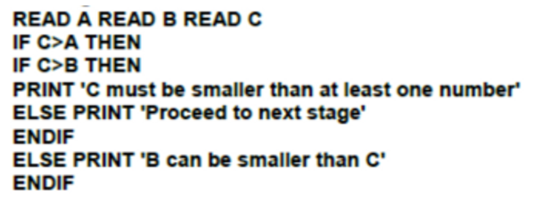
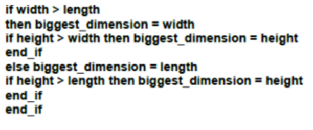

<h2>TASK: Please present the pseudocode as a block diagram.</h2>
<h3>Task 1</h3>

Jaka jest minimalna liczba przypadków testowych niezbędnych do zagwarantowania 100% pokrycia instrukcji  i 100% pokrycia decyzji?

What is the minimum number of test cases necessary to guarantee 100% instruction coverage and 100% decision coverage?

Answer: Coverage of instructions = 2, Coverage of decisions = 2

<h3>Task 2</h3>

Jaka jest minimalna liczba przypadków testowych niezbędnych do zagwarantowania 100% pokrycia ścieżek?

What is the minimum number of test cases needed to guarantee 100% path coverage?

Answer: Coverage of path = 2

<h3>Task 3</h3>

Jaka jest minimalna liczba przypadków testowych niezbędnych do zagwarantowania 100% pokrycia instrukcji i 100% pokrycia decyzji?

What is the minimum number of test cases necessary to guarantee 100% instruction coverage and 100% decision coverage?

Answer: Coverage of instructions = 3, Coverage of decisions = 3

<h3>Task 4</h3>

Jaka jest minimalna liczba przypadków testowych niezbędnych do zagwarantowania 100% pokrycia decyzji?

What is the minimum number of test cases needed to guarantee 100% decision coverage?

Answer: Coverage of decisions = 4

